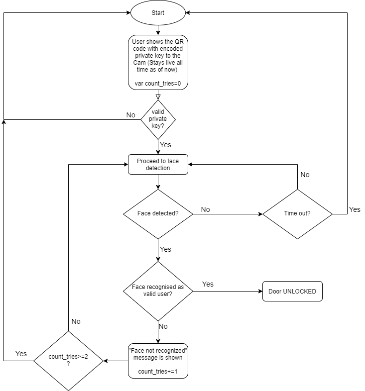

# QRcode-FaceRecognition-Door-Lock-system-Arduino-IOT
Door lock system using Arduino and Python with 2 step authentication(Face Recognition and QR code).

<b>For working demo and explanation of this project checkout : https://youtu.be/BthykmlISSw</b>

<b>Important files</b>: 
* <b>[face_recognition_complete.ino](https://github.com/Amal4m41/QRcode-FaceRecognition-Door-Lock-system-Arduino-IOT/blob/master/Arduino_code/face_recognition_complete/face_recognition_complete.ino)</b> : code that is uploaded onto the Arduino board.  
* <b>[faces.py](https://github.com/Amal4m41/QRcode-FaceRecognition-Door-Lock-system-Arduino-IOT/blob/master/faces.py)</b> : script that contains only face recognition code(just to detect the face and recognize it if the face is trained with the model)  
* <b>[faces_train.py](https://github.com/Amal4m41/QRcode-FaceRecognition-Door-Lock-system-Arduino-IOT/blob/master/faces_train.py)</b> : script that creates the face classification model by training upon the images stored in the images folder and creates a pickle file with the label ids (i.e. name of the user is label encoded for training the model)  
* <b>[qr_face_recogntion.py](https://github.com/Amal4m41/QRcode-FaceRecognition-Door-Lock-system-Arduino-IOT/blob/master/qr_face_recogntion.py)</b> : main file that takes care of the 2 step authentication using QR code and face recognition, communication with Arduino(Open or Close the door), user interaction using text to speech etc.  
* <b>The authentication process</b> :   

* <b>Arduino connection diagram</b> :   

